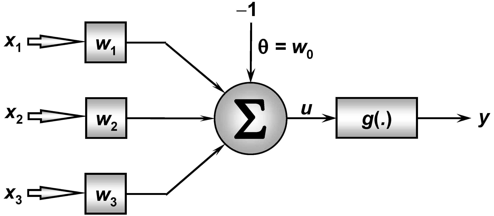

<h1>RedePerceptron</h1>

Implementação da Rede Neural Perceptron de camada única proposta no Projeto prático 3.6 do livro "Redes Neurais Arficiais para engenharia e ciências aplicadas" do autor Ivan Nunes da Silva.

<h4>
Aluno: Jônatas Trabuco Belotti 
Email: jonatas.t.belotti@hotmail.com
</h4>

<h2>Arquitetura da rede</h2>

A rede possui um neurônio único, com três sinais de entrada, um limiar de ativação e uma função de ativação do tipo Degrau Bipolar. Conforme a imagem a seguir.

<h2>Arquivos</h2>

Os arquivos do repositórios são:

<b>Pasta "Dados" - </b> Contém um arquivo de exemplo para os dados de treinamento da rede "Dados para treinamento.txt" e um arquivo de exemplo para os dados a serem classificados durante a execução da rede "Dados execução.txt".

<b>Pasta "RedePerceptron" - </b> Contém o projeto do NetBeans com a implementação da rede Perceptron em Java.

<b>Arquivo "Rede Perceptron.exe" - </b> Arquivo executavel da rede para ser executado em Windows.

<b>Arquivo "RedePerceptron.jar" - </b> JAR da rede para ser executado em linux ou Windows.

<b>Arquivo "Relatorio_Perceptron.pdf" - </b> Arquivo PDF contendo o relatório entregue para a diciplina.
